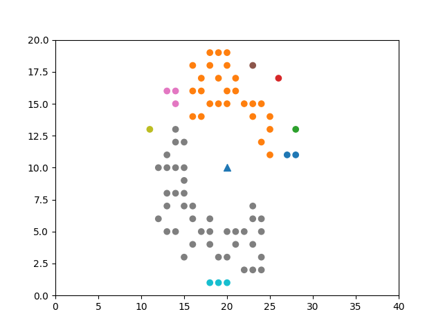

# Connected Components for Lidar Data Segmentation
This repository contains a Python implementation of the paper titled ["Connected Components for a Fast and Robust 2D Lidar Data Segmentation"](https://www.researchgate.net/publication/261156539_Connected_Components_for_a_Fast_and_Robust_2D_Lidar_Data_Segmentation). The implementation provides a method for segmenting 2D lidar data into connected components, enabling the identification of distinct objects or regions in the environment.

## Paper Information
* Title: Connected Components for Lidar Data Segmentation
* Authors: Daniel O˜noro Rubio, Artem Lenskiy and Jee-Hwan Ryu
* DOI: 10.1109/AMS.2013.31

## Introduction
Segmenting lidar data into meaningful components is a crucial step in many robotic applications, such as autonomous navigation, object detection, and scene understanding. This implementation offers a Python implementation of the connected components algorithm described in the referenced paper. It enables the extraction of connected regions from 2D lidar data, allowing for efficient and robust segmentation.

## Features
* Segmentation of 2D lidar data into connected components
* Random lidar point generation in polar coordinates for testing and visualization
* Visualization of lidar data segmentation resutls

## Requirements
* Matplotlib
* Numpy
* math library

## File Structure
* cc_segmentation.py: The main script that performs segmentation given lidar points in polar coordinates.
* test.py: A script that generates some random coordinates in polar coordinates, applies the algorithm and visualizes the results.
* images/: Directory to store and generated visualization images.

## Results
To showcase the flexibility of the implementation, random lidar points were generated in polar coordinates using the provided function. The generated points were then segmented using the connected components algorithm. The resulting segmentation highlighted different regions based on their connectivity, effectively separating clusters of lidar points. The visualization provided a clear representation of the algorithm's ability to identify connected components within the point cloud data.

